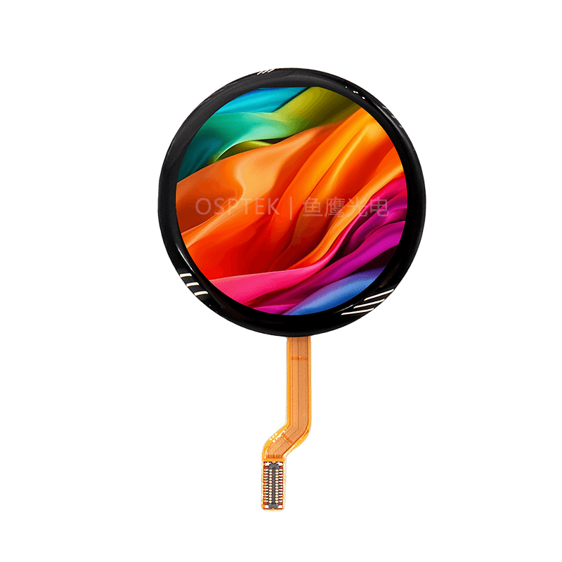

<p align="left"></p>

<h1 align="center">OSPTEK 1.19″ AMOLED 390×390（CO5300 · QSPI）</h1>

<p align="center"><b>圆形 AMOLED 模组 · QSPI · CO5300</b></p>

<p align="center"><a href="./README_EN.md">English</a> | 简体中文 · <a href="../../README.md">规格族索引</a></p>

<p align="center">
  
  
  
  
</p>

<p align="center"></p>

## 目录

- [产品简介](#产品简介)
- [规格参数](#规格参数)
- [示例工程](#示例工程)
- [仓库结构](#仓库结构)
- [相关资料](#相关资料)
- [购买链接](#购买链接)
- [技术支持](#技术支持)

---

## 产品简介

OSPTEK **1.19 寸 390×390 AMOLED** 是一款 **QSPI** 接口彩色显示模组，显示驱动为 **CO5300**，触摸驱动为 **CST820**。方形分辨率适合穿戴表盘、圆形小屏 HMI 等场景。

规格标识（仓库名）：`amoled-1.19-390x390-qspi-co5300`

当前模组版本：**AM119Q390390FLS2**。电气与外形细节以 [`docs/AM_119_Q390390_FLS_2_2507034eef.pdf`](./docs/AM_119_Q390390_FLS_2_2507034eef.pdf) 为准。

## 规格参数

| 项目 | 规格 |
| ---- | ---- |
| 尺寸 | 1.19 英寸 |
| 类型 | AMOLED（彩色） |
| 分辨率 | 390×390 |
| 接口 | QSPI |
| 驱动 IC | CO5300 |
| 触摸驱动 | CST820 |

> 完整外形尺寸、FPC 定义、供电与时序以产品规格书 / 驱动手册为准。

## 示例工程

| 说明 | 路径 |
| ---- | ---- |
| ESP32-S3 · CO5300 QSPI + esp-lvgl-adapter / LVGL8 | [`examples/esp32s3-idf5_co5300-qspi_esp-lvgl-adapter_lvgl8/`](./examples/esp32s3-idf5_co5300-qspi_esp-lvgl-adapter_lvgl8/) |
| ESP32-S3 · CO5300 QSPI + esp-lvgl-adapter / LVGL9 | [`examples/esp32s3-idf5_co5300-qspi_esp-lvgl-adapter_lvgl9/`](./examples/esp32s3-idf5_co5300-qspi_esp-lvgl-adapter_lvgl9/) |
| ESP32-S3 · LVGL8 + TE 防撕裂 | [`examples/with-te/esp32s3-idf5_co5300-qspi_esp-lvgl-adapter_lvgl8_amoled-with-te/`](./examples/with-te/esp32s3-idf5_co5300-qspi_esp-lvgl-adapter_lvgl8_amoled-with-te/) |
| ESP32-S3 · LVGL9 + TE 防撕裂 | [`examples/with-te/esp32s3-idf5_co5300-qspi_esp-lvgl-adapter_lvgl9_amoled-with-te/`](./examples/with-te/esp32s3-idf5_co5300-qspi_esp-lvgl-adapter_lvgl9_amoled-with-te/) |

## 仓库结构

```text
amoled-1.19-390x390-qspi-co5300/                                # 仓库根（导航见 ../../README.md）
└── versions/
    └── AM119Q390390FLS2/                                # 本料号完整资料
        ├── README.md
        ├── README_EN.md
        ├── images/
        ├── docs/
        └── examples/
```

## 相关资料

### 本产品资料

| 资料 | 链接 |
| ---- | ---- |
| 产品规格书（AM119Q390390FLS2） | [`docs/AM_119_Q390390_FLS_2_2507034eef.pdf`](./docs/AM_119_Q390390_FLS_2_2507034eef.pdf) |
| 驱动 IC 数据手册（CO5300） | [`docs/CO_5300_Datasheet_V0_00_20230328_07edb82936.pdf`](./docs/CO_5300_Datasheet_V0_00_20230328_07edb82936.pdf) |
| 触摸 IC 数据手册（CST820） | [`docs/DS_CST_820_V1_2_e0543732ca.pdf`](./docs/DS_CST_820_V1_2_e0543732ca.pdf) |
| 初始化序列（文本） | [`docs/AM119Q390390FLS2.txt`](./docs/AM119Q390390FLS2.txt) |
| 1.19 寸屏幕转接板 V1.1 | [`docs/1.19屏幕转接板V1.1.pdf`](./docs/1.19屏幕转接板V1.1.pdf) |

### 示例工程

- [ESP32-S3 CO5300 QSPI + LVGL8](./examples/esp32s3-idf5_co5300-qspi_esp-lvgl-adapter_lvgl8/)
- [ESP32-S3 CO5300 QSPI + LVGL9](./examples/esp32s3-idf5_co5300-qspi_esp-lvgl-adapter_lvgl9/)
- [ESP32-S3 LVGL8 + TE](./examples/with-te/esp32s3-idf5_co5300-qspi_esp-lvgl-adapter_lvgl8_amoled-with-te/)
- [ESP32-S3 LVGL9 + TE](./examples/with-te/esp32s3-idf5_co5300-qspi_esp-lvgl-adapter_lvgl9_amoled-with-te/)

## 购买链接

<p align="center">
  <a href="https://shop110742373.taobao.com/"></a>
  &nbsp;&nbsp;
  <a href="https://www.aliexpress.com/store/1105701619"></a>
</p>

**国内（淘宝）**

- 店铺：[鱼鹰光电工厂店](https://shop110742373.taobao.com/)

**海外（AliExpress）**

- 店铺：[OSPTEK Official Store](https://www.aliexpress.com/store/1105701619)

## 技术支持

- 技术支持 / 产品咨询：<luyu@osptek.com>
- QQ 技术交流群：**985881096**
- 公司官网：<https://osptek.com/>
- 有任何问题，都可以在本仓库 Issues 中提问

---

<p align="center"><sub>© 2026 OSPTEK 鱼鹰光电 · 本仓库资料采用 CC BY 4.0 许可</sub></p>
